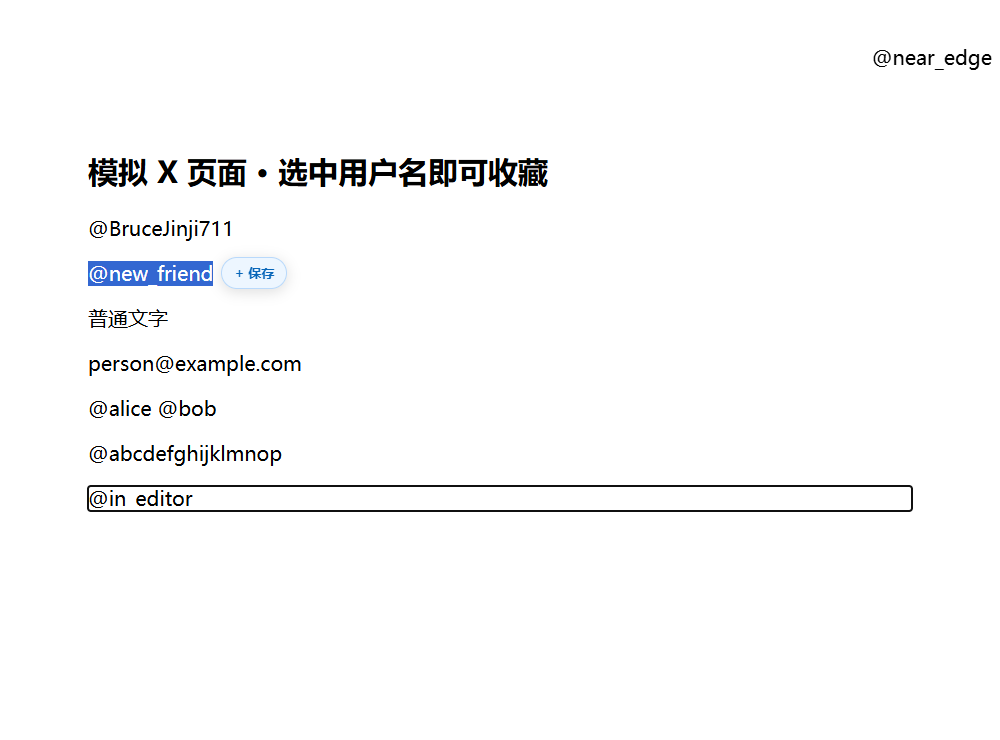
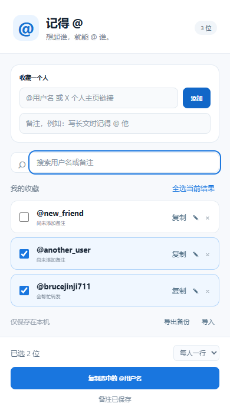

# 记得 @ · X Mention Saver

**有人说「写长文记得 @ 我」，下次却想不起用户名？把他们留在这里。**

一个轻量的 Chrome / Edge 插件：在 X 上选中 `@用户名`，点旁边的「保存」；发帖时勾选想 @ 的人，一次复制，直接粘贴。

[下载安装包](https://github.com/hskelp9527-pixel/x-mention-saver/releases/latest) · [反馈问题](https://github.com/hskelp9527-pixel/x-mention-saver/issues/new/choose) · [English](#english)

[](https://github.com/hskelp9527-pixel/x-mention-saver/actions/workflows/checks.yml)
[](https://github.com/hskelp9527-pixel/x-mention-saver/releases/latest)
[](LICENSE)

## 使用效果

在 X 页面选中用户名，保存按钮出现在旁边，避开选中文字。以下演示使用模拟页面与测试数据。



搜索、备注、勾选，然后一键复制成 `@alice @bob`。



## 能做什么

- 选中即保存：完整选中 `@用户名` 后才显示按钮，不使用右键菜单。
- 自动去重：同一用户名忽略大小写；页面重复保存保留已有备注。
- 收藏管理：手动添加、编辑备注、搜索、删除。
- 一键复制：单人复制或多选复制，支持空格与换行分隔。
- 本机备份：导出 / 导入 JSON，不需要账号或云服务。

## 安装，三步即可

目前通过开发者模式安装，尚未上架 Chrome Web Store 或 Edge Add-ons。Windows 和 macOS 上的 Chrome、Edge 都能用（Safari 不支持）。

1. 在 [Releases](https://github.com/hskelp9527-pixel/x-mention-saver/releases/latest) 下载 **x-mention-saver.zip**，解压到一个准备长期保留的文件夹。
2. Chrome 地址栏打开 `chrome://extensions`，Edge 打开 `edge://extensions`，开启「开发者模式」。
3. 点击「加载已解压的扩展程序」，选择包含 `manifest.json` 的解压文件夹。固定插件到工具栏，并刷新已打开的 X 页面。

更新时先导出备份，再把新版本解压到同一文件夹，点击扩展页面上的「重新加载」并刷新 X。尽量不要卸载重装，卸载会清除本机收藏。

## 怎么用

**保存：** 在 X / Twitter 页面拖选完整的 `@用户名`，点击「+ 保存」。也可以打开插件，手动输入用户名或个人主页链接，加一句备注。

**复制：** 打开插件，勾选需要 @ 的人，点击「复制选中的 @用户名」，粘贴到正文或回复。搜索只缩小显示范围，复制仍包含全部已勾选的人；数量显示在底部。每次重新打开弹窗，勾选会清空，收藏与备注保留。

**备份：** 点击「导出备份」下载 JSON。「导入」会合并，重复用户名保留已有备注。手动重复添加则可以更新备注。

## @ 了，对方就一定收到通知吗？

插件负责复制正确格式，无法保证 X 发送通知。根据 [X 官方说明](https://help.x.com/en/using-x/types-of-posts)，长帖子在前 280 个字符之后的提及目前不会通知对方；写长文时把 @ 放在靠前的位置。对方的 [通知过滤设置](https://help.x.com/en/managing-your-account/understanding-the-notifications-timeline) 也会影响是否收到通知。

发布后，用户名能点击进入对应主页，说明被识别成了提及。粘贴时建议与正文之间留空格或换行。批量复制默认已经使用空格分隔。

## 识别与隐私

选中文字去掉首尾空白后，必须完整匹配 `^@[A-Za-z0-9_]{1,15}$`。普通文字、中文昵称、邮箱、多个用户名、包含空格或标点的内容都不会触发；发帖编辑框与输入框内不显示保存按钮。短用户名也允许，以兼容已有账号。只检查格式，不联网验证账号是否存在。

收藏仅存于当前浏览器的 `chrome.storage.local`。没有云同步或统计服务，不调用 X API，不自动发帖。权限为 `storage` 与 `clipboardWrite`；内容脚本仅在 X / Twitter 网站运行。所有运行代码都包含在仓库里，没有第三方运行时依赖。

## 开发与验证

运行插件无需构建或安装依赖。测试需要 Node.js 22 或更新版本：

```sh
npm ci
npm test
npx playwright-core install chromium
npm run test:browser
```

Windows 若安装了 Edge，浏览器测试会优先使用 Edge。也可设置 `BROWSER_PATH` 指向浏览器可执行文件。测试使用独立临时资料目录、真实扩展和模拟 X 页面，不登录个人账号。覆盖收藏、重复保护、备注、搜索、剪贴板、按钮位置、数据保留及无效备份的原子回滚；不验证 X 实际通知投递。

生成安装包需要 Python 3：

```sh
python scripts/package.py
```

产物在 `dist/x-mention-saver.zip`，只包含插件运行文件、说明和许可证。GitHub Actions 自动运行测试和打包检查。改动和贡献方式见 [CONTRIBUTING.md](CONTRIBUTING.md)。

同一作者的另一个 X 插件：[X Daily Rings · 每日输出环](https://github.com/hskelp9527-pixel/x-daily-rings)，把每天的发帖、回复、引用数量做成三个圆环挂在页面上。

## English

**Remember the people who asked you to mention them on X.**

X Mention Saver is a Chrome / Edge extension with a Chinese interface. Select an entire `@handle` on X, click the small Save button beside it, then open the extension to select saved people and copy their mentions together. Supports notes, search, duplicate protection, single or batch copying, and JSON backup. Everything is stored locally; no account, analytics, cloud service, or X API is required.

Download **x-mention-saver.zip** from [Releases](https://github.com/hskelp9527-pixel/x-mention-saver/releases/latest), unzip it, enable Developer mode in `chrome://extensions` or `edge://extensions`, and choose **Load unpacked**. Select the folder containing `manifest.json`, pin the extension, and refresh X. This extension is not currently listed in browser extension stores.

Batch copies contain spaces by default. X may not notify accounts mentioned after the first 280 characters of a long post, and recipient notification filters can also apply. This tool copies handles; it does not guarantee notification delivery.

MIT licensed. Independent project, not affiliated with X Corp.
